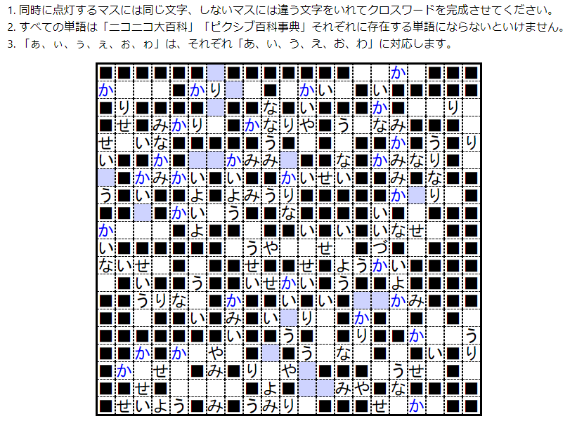

# React Nankuro (Number Crossword) Generator

[ブラウザですぐにプレイできます。](https://mitosagi.github.io/react-nankuro-gen/)

## 解説

ナンクロを単語リストのみから自動で生成してプレイできるWebアプリです。盤面の生成アルゴリズムには[Crossword-Layout-Generator](https://github.com/MichaelWehar/Crossword-Layout-Generator)を使用しています。

サンプルではネット用語に関する辞典の見出し語を単語リストとして与えていますが、日本語であれば別のリストを使用することもできます。

## 意図

興味や関心のある分野の単語から自動でクロスワードパズルを生成して共有できれば、ニュースサイトにミニゲームとして埋め込むなどの様々な楽しみ方ができそうです。そこで、検討のためにクロスワードパズルを単語リストから自動で生成するライブラリを探しました。[Crossword-Layout-Generator](https://github.com/MichaelWehar/Crossword-Layout-Generator)というライブラリはまさにその目的に合致しています。しかし一つ問題があります。そもそもクロスワードパズルはタテとヨコのカギを人間が考える必要があるため自動での作問は困難です。この問題は、ナンクロというパズルを使うことで回避できました。ナンクロでのヒントの与え方はクロスワードと異なり、タテとヨコのカギではなく、同じ数字が書かれたマスには同じ文字が入るという制約によります。この違いのおかげで、自然言語によるカギが不要になり、単語がクロスするという共通点のおかげで、使用する文字種を減らした単語リストからクロスワードと同じアルゴリズムで盤面を生成することができます。ところで、今回作成したナンクロには数字がありません。Webでは紙面と違い共通するマスをインタラクティブに指し示すことができるからです。

## ライセンス

コード部はMITライセンスです。単語リストである`dic-nico-intersection-pixiv.txt`については[ncaq/dic-nico-intersection-pixiv#ライセンス](https://github.com/ncaq/dic-nico-intersection-pixiv#%E3%83%A9%E3%82%A4%E3%82%BB%E3%83%B3%E3%82%B9)をご確認ください。

